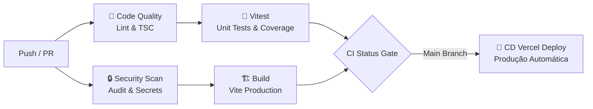

# 🏋️‍♂️ FitControl (WorkControl)

> **Sistema Integrado de Gestão Industrial, Controle de Produção e Rastreabilidade de Evidências para Oficinas de Equipamentos.**

[](https://github.com/kigutig/workcontrol/actions/workflows/ci.yml)
[](https://github.com/kigutig/workcontrol/actions/workflows/cd.yml)
[](https://github.com/kigutig/workcontrol/actions/workflows/codeql.yml)
[](https://github.com/kigutig/workcontrol/actions/workflows/security.yml)
[-brightgreen.svg)](https://github.com/kigutig/workcontrol/security/dependabot)
[](coverage/index.html)
[](https://nodejs.org)
[](https://www.typescriptlang.org/)
[](LICENSE)

---

## 📌 Visão Geral

O **FitControl** é uma plataforma full-stack moderna desenvolvida para digitalizar e otimizar o fluxo de trabalho industrial em oficinas de fabricação, montagem e reforma de equipamentos. 

A plataforma conecta supervisores e operadores de chão de fábrica em tempo real, permitindo rastrear o progresso das tarefas, tempos operacionais, etapas produtivas e evidências fotográficas de qualidade com suporte a dispositivos móveis (Android/PWA).

---

## ✨ Funcionalidades Principais

- 📋 **Quadro de Tarefas & Kanban Interativo**: Visualização ágil por status (*Pendente, Em Produção, Pausado, Concluído*), máquina e prioridade.
- ⏱️ **Cronometragem e Auto-Pause Inteligente**: Cálculo preciso de tempo de execução com regra automática de auto-pausa após o horário operacional (18:00).
- 📸 **Rastreamento de Evidências Fotográficas**: Upload e validação de fotos de progresso e entrega, com integração nativa de câmera via Capacitor e Supabase Storage.
- 📊 **Dashboard & Relatórios Gerenciais**: Gráficos de produtividade, tempos médios por máquina/colaborador, relatórios comparativos e exportação para PDF/Impressão.
- 🏭 **Gestão de Parque de Máquinas e Colaboradores**: Cadastro detalhado de máquinas, setores e controle de permissões por perfil (*Supervisor* vs *Operador*).
- 🛡️ **Segurança de Nível Empresarial (DevSecOps)**: Sanitização XSS multi-camada, validação estrita de UUIDs v4, proteção contra injeções, autenticação segura e Row Level Security (RLS) no banco de dados.

---

## 🛠️ Stack Tecnológica

### Frontend & Mobile
- **Core:** [React 19](https://react.dev/) + [TypeScript 5.8](https://www.typescriptlang.org/)
- **Roteamento & SSR:** [TanStack Router](https://tanstack.com/router) & [TanStack Start](https://tanstack.com/start)
- **Estilização:** [Tailwind CSS](https://tailwindcss.com/) + Design System Dark/Light
- **Componentes:** [Radix UI](https://www.radix-ui.com/) + [Lucide Icons](https://lucide.dev/)
- **Visualização de Dados:** [Recharts](https://recharts.org/)
- **Mobile Nativo:** [Capacitor](https://capacitorjs.com/) (Câmera nativa, notificações locais e suporte Android)

### Backend & Nuvem
- **Autenticação & Banco de Dados:** [Supabase](https://supabase.com/) (PostgreSQL com RLS)
- **Armazenamento:** Supabase Storage (Buckets de evidências)
- **Hospedagem & Deploy:** [Vercel](https://vercel.com/) (Edge / Serverless)

### Testes & Qualidade
- **Testes Unitários & Integração:** [Vitest](https://vitest.dev/) (88.9% de cobertura) + [@testing-library/react](https://testing-library.com/)
- **Testes End-to-End (E2E):** [Playwright](https://playwright.dev/) (Navegação, Auth e Testes de Segurança)
- **Linting & Formatação:** [ESLint 9](https://eslint.org/) (Flat Config) + [Prettier](https://prettier.io/)

---

## 🚀 Como Executar Localmente

### Pré-requisitos
- **Node.js**: Versão `>= 22.0.0`
- **npm**: Versão `>= 10.0.0`

### 1. Clonar o repositório
```bash
git clone https://github.com/kigutig/workcontrol.git
cd workcontrol
```

### 2. Instalar dependências
```bash
npm install
```

### 3. Configurar Variáveis de Ambiente
Crie um arquivo `.env` na raiz do projeto baseado no `.env.example`:
```bash
cp .env.example .env
```

Preencha com suas credenciais do Supabase:
```env
VITE_SUPABASE_URL=https://sua-url-supabase.supabase.co
VITE_SUPABASE_ANON_KEY=sua-chave-anonima-jwt
```

### 4. Iniciar Servidor de Desenvolvimento
```bash
npm run dev
```
O aplicativo estará disponível em: **`http://localhost:3000`**

---

## 📜 Scripts Disponíveis

| Comando | Descrição |
|---|---|
| `npm run dev` | Inicia o servidor de desenvolvimento local |
| `npm run build` | Compila o projeto para produção via Vite/TanStack Start |
| `npm run preview` | Executa o preview local da build compilada |
| `npm run lint` | Executa a verificação estática de código com ESLint |
| `npm run format` | Formata todo o código-fonte com Prettier |
| `npm run test` | Executa os testes unitários com Vitest |
| `npm run test:coverage` | Executa os testes unitários e gera relatório HTML de cobertura |
| `npm run test:e2e` | Executa a suíte de testes E2E com Playwright |
| `npm run test:e2e:ui` | Abre a interface gráfica interativa do Playwright |
| `npm run test:security` | Executa exclusivamente a bateria de testes E2E de segurança |
| `npm run test:all` | Executa testes unitários, cobertura e testes E2E em sequência |

---

## 📊 Relatórios de Testes e Cobertura

### Relatório de Cobertura Unitária (Vitest)
Para gerar e abrir o relatório visual no navegador:
```bash
npm run test:coverage
# No Windows PowerShell:
Start-Process "coverage/index.html"
```

### Relatório dos Testes E2E (Playwright)
```bash
npx playwright show-report
```

---

## 🔄 CI/CD & Automação DevSecOps

O repositório possui uma esteira completa de CI/CD implementada em **GitHub Actions**:



### Workflows Configurados:
1. **🔁 `ci.yml` (Integração Contínua)**:
   - Validação de formatação (Prettier) e tipagem estrita (TypeScript `tsc --noEmit`).
   - Linting via ESLint 9.
   - Auditoria de dependências com `npm audit`.
   - Secret scanning automatizado com **Gitleaks**.
   - Bateria de testes unitários com Vitest (88.9% de cobertura).
   - Validação de build de produção e análise de tamanho de bundle.

2. **🚀 `cd.yml` (Entrega Contínua)**:
   - Deploy automático na **Vercel** a cada push aprovado na branch `main`.
   - Geração automática de release tags versionadas por data/commit.

3. **🔬 `codeql.yml` (SAST - Static Application Security Testing)**:
   - Análise profunda do código TypeScript para prevenção de XSS, injeção e vulnerabilidades de fluxo de dados.

4. **🛡️ `security.yml` (DevSecOps Completo)**:
   - Geração de **SBOM** (Software Bill of Materials) no padrão CycloneDX.
   - Varredura de sistema de arquivos e dependências com **Trivy**.
   - Análise estática com regras OWASP Top 10 via **Semgrep**.

---

## 🔐 Configuração de Secrets no GitHub

Para que o pipeline execute com 100% de automação, cadastre os seguintes secrets em:  
**Settings → Secrets and variables → Actions**:

| Secret | Descrição |
|---|---|
| `VERCEL_TOKEN` | Token de autenticação da CLI do Vercel |
| `VERCEL_ORG_ID` | ID da organização/time no Vercel |
| `VERCEL_PROJECT_ID` | ID do projeto no Vercel |
| `VITE_SUPABASE_URL` | URL da instância do Supabase |
| `VITE_SUPABASE_ANON_KEY` | Chave anônima pública do Supabase |

---

## 📁 Estrutura do Projeto

```
workcontrol/
├── .github/
│   ├── workflows/        # Pipelines CI, CD, CodeQL e DevSecOps
│   ├── CODEOWNERS        # Governança de revisores de código
│   ├── dependabot.yml    # Atualizações automáticas de segurança
│   └── pull_request_template.md # Checklist de PRs
├── e2e/                  # Testes End-to-End com Playwright
│   ├── auth.spec.ts      # Testes de login e rotas
│   ├── dashboard.spec.ts # Testes de painel e navegação
│   └── security.spec.ts  # Testes de headers, XSS e HTTPS
├── src/
│   ├── __tests__/        # Testes unitários com Vitest
│   ├── components/       # Componentes de interface (UI / Modais / Editor)
│   ├── hooks/            # React Hooks customizados
│   ├── integrations/     # Clientes Supabase e definições de tipos
│   ├── lib/              # Funções utilitárias e segurança (security.ts)
│   ├── routes/           # Rotas TanStack Router (Dashboard, Tarefas, etc.)
│   ├── styles.css        # Configurações globais do Tailwind CSS
│   └── declarations.d.ts # Declarações de tipos TypeScript
├── vercel.json           # Configuração de build e output para Vercel
├── vitest.config.ts      # Configuração de testes unitários e cobertura
├── playwright.config.ts  # Configuração de testes E2E
└── package.json          # Dependências e scripts
```

---

## 👥 Contribuição & Governança

1. Crie uma branch para sua funcionalidade (`git checkout -b feature/minha-feature`).
2. Garanta que os testes e linters estejam passando (`npm run test && npm run lint`).
3. Abra um Pull Request com o checklist preenchido.
4. O pipeline de CI/CD validará o código automaticamente antes do merge.

---

## 📄 Licença

Este projeto está sob a licença [MIT](LICENSE). Desenvolvido por **[@kigutig](https://github.com/kigutig)**.
